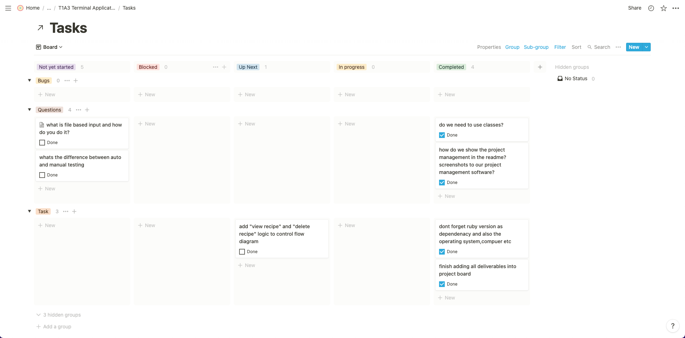
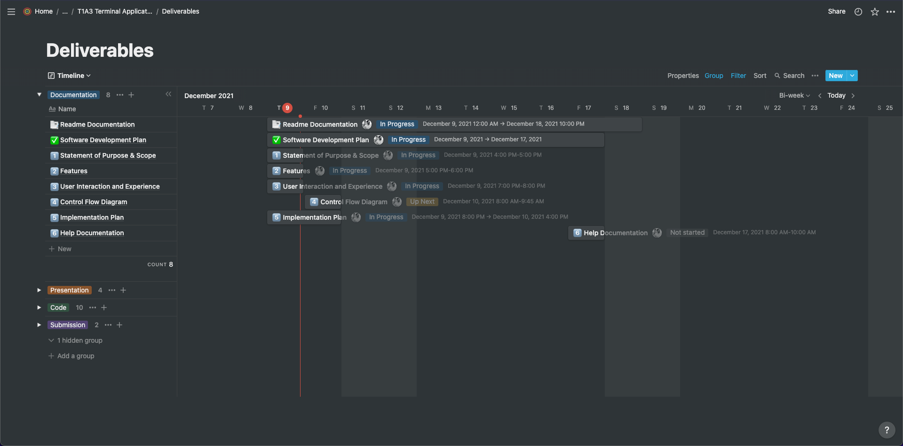
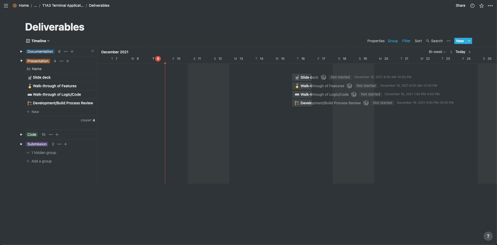
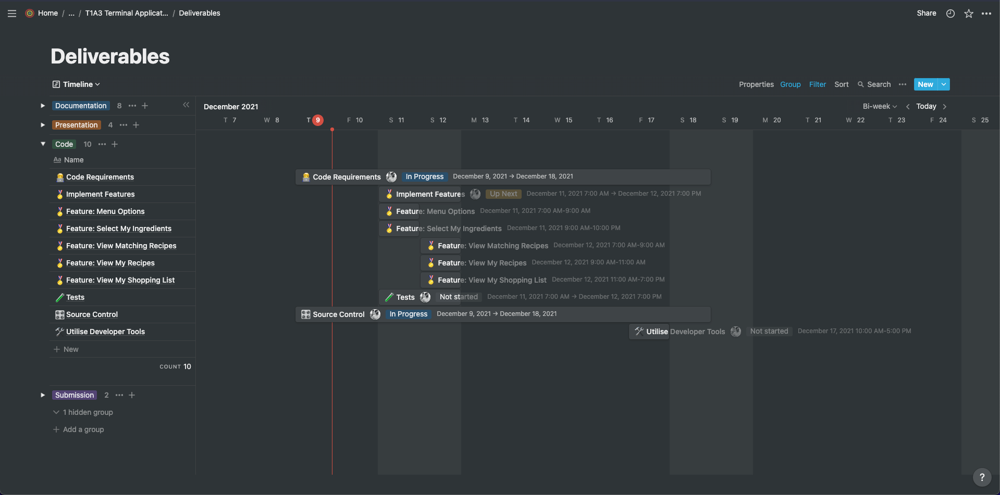
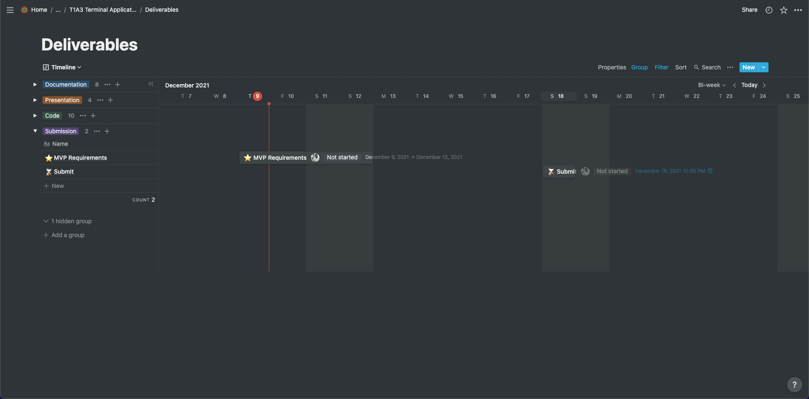

# JasonSandeman_T1A3 - Terminal Application

A recipe suggestion app written using ruby.

## 🔗 Links

View the source code on GitHub [here](https://github.com/jwsandeman/JasonSandeman_T1A3)

View my Notion Project Management Dashboard [here](https://jwsandeman.notion.site/T1A3-Terminal-Application-efe7f174b7fa4dd69b60a83e1c0847ab)

[](https://festive-aryabhata-690f3c.netlify.app/index.html)
[](https://www.linkedin.com/in/jason-sandeman-33268496/)
[](https://twitter.com/jwsandeman)

## Installation

Clone the project

```bash
  git clone https://github.com/jwsandeman/JasonSandeman_T1A3.git
```

Go to the project directory

```bash
  cd JasonSandeman_T1A3
```

Install dependencies and run application

```bash
  ./install.sh
```

## Software Development Plan

### 1. Purpose & Scope

I will be building a recipe suggestion app based on the selections that a user makes. The app will ask the user what ingredients they currently have at home and then suggest relevant recipes based on matching ingredients. These matching recipes will be displayed in a list with how many matching ingredients each recipe has. Any ingredients that the user is missing from the recipe is automatically added to a shopping list to make it easier to reference when shopping. They will also be able to view the cooking instructions for each of their chosen recipes.

#### Why Build It

This app helps users quickly find recipes based on what ingredients they already have at home and reduces the amount of ingredients they have to go out and buy. This prevents users from wasting time finding recipes that involve ingredients they dont have at home which is a very common and very frustrating problem. It also helps prevent them from doubling up on ingredients when shopping for multiple recipes as it tells the user exactly how much of each ingredient they need for each recipe.

#### Target Audience

The target audience is anyone looking for ideas of what to cook based on the ingredients they already have at home and any ingredients that they need will be added to a handy shopping list for quick reference.

#### How To Use It

Following the installation instructions above, and once all the dependencies have been installed, the application will run. Once the application is running users will be able to navigate through the menus using the directional arrows and the enter key. The app will also prompt the user to answer questions as necessary. Once the user has finished using the application they will be able to select "Exit" from the main menu to close the application.

### 2. Features

When a user first runs the app they will be presented with an interactive TTY-Prompt menu of options displaying the following features: 1. Select Ingredients - This is where you select ingredients you currently have at home. You can add or remove as many ingredients as you want. 2. Matching Recipes - This shows a list of recipes that match your ingredients. You can select as many recipes as you want. You can also remove recipes if you change your mind. 3. My Recipes - Here you can view your recipes and then select a recipe to view the cooking instructions for that recipe. 4. Shoppig List - This is a list of all of the ingredients that are missing from your selected recipes. 5. Exit - This will close the application.

#### Select Ingredients

- The next menu gives the user the option to choose "add ingredients" or "remove ingredients".
- Users can view a list of ingredients that is populated from all available recipes. This will be done usig an recipe class that i will seed with around 20 recipes.
- They will be able to select the ingredients that they currently have in their cupboard/fridge. Once they select an ingredient that ingredient will be used to access the "ingredient_selected" attribute in the individual_recipe class and set it to "true".
- Users will also be able to remove ingredients if they make a mistake or change their mind. This will be done in a similar method except it will set "ingredient_selected" to "false".

#### Matching Recipes

- Once Users have selected their ingredients they will be able to view their matching recipes which will be populated based on a class method that sums up the total "true" values for each recipe and returns matching_ingredients.
- This number is then used to sort recipes in descending order starting with recipes with the highest matching_ingredients.
- Users will be able to select as many recipes as they want and add them to their selected recipes (My Recipes). This will be done by changing the "recipe_selected" attribute in the recipe class to "true".

#### My Recipes

- Users will then be able to view the list of the recipes that they have selected. These recipes will be populated based on returning the recipes that have the "recipe_selected" attribute set to "true".
- They will have the option to select an individual recipe and view the instructions on how to prepare and cook it. TTY-Prompt will open the selected recipe and the cooking instructions will be displayed using a method from the individual_recipe class.
- Users will be able to remove recipes if they made a mistake or change their mind. This will be done by setting the "recipe_selected" attribute in the recipe class to "false".

#### Shopping List

- Once users have added recipes they will be bale to view all of the missing ingredients that are required to make the recipes they have selected. The missing ingredients will be populated by iterating through each recipe and finding ingredients that have the "ingredient_selected" attribute set to "false" and printing the associated ingredient to the screen.
- Each ingredient on the shopping list will have the related recipe in brackets next to it for quick reference. For each ingredient that is printed to the screen it will also have its parent recipe name printed next to it in brackets.

### 3. User Interaction and Experience

#### Welcome Screen

- The user will be greeted by a welcome screen and prompted to enter their name.
- If they dont enter a string, they will be prompted to enter their name again until a string is entered.
- Once they do this they will be given a greeting prompt explaining how to interact with the menu options. This will form the basis for all user interactions in the app.
- The reason I am using TTY-Prompt for most of my user input is to simplify the user experience but also it comes with the added benefit of error handling as users are limited in what they can actually input/select. If they dont select the correct option or input an in invalid option they will receive a prompt on the screen indicatng that they have made an error and that they should try again. Errors will be displayed in red using colorize.

#### Main Menu

- After the user is greeted by the app, they will be shown a list of menu items that they can interact with using the arrow "keys" and options can be selected using the "enter" key.
- I will be using the same navigation system when users are selecting ingredients, selecting recipes, viewing recipes and viewing the shopping list.

#### Select Ingredients

User will be shown a sub-menu with 2 options:

1. Add Ingredients

   - This takes them to the ingredients screen where they can start adding ingredients that they have at home.
   - Everytime they add an ingredient it will be added to a new list above the available ingredients called "My Ingredients".
   - This list will be a quick reference and a confirmation that they have sucessfully added their ingredient.
   - If they try to add the same ingredient twice they will be told that they have already added that ingredient.
   - Once they have finished adding ingredients they will be able to select "Finished adding ingredients" which will take them back to the main menu.

2. Remove Ingredients
   - This will only be available once they have already added some ingredients
   - If they try to remove ingredients before adding any ingredients they will given an eerror message and taken back to the sub-menu

#### Matching Recipes

- Users will be shown a list of the matching recipes and how many ingredients are matching for each recipe.
- They will be able to arrow down through the list of recipes and press enter to add a recipe to their list called "My Recipes".
- Everytime they add a recipe it will be displayed above the available recipes in a new list with a heading "My Recipes".
- If they try to add the same recipe twice they will be told that they have already added that recipe.
- Once they are finished adding recipe's they will be able to select "finished adding recipes" which will take them back to the main menu.

#### My Recipes

User will be shown a sub-menu with 2 options:

1. View Recipes

   - Users will be shown a list of the recipes that they have selected.
   - They will be able to arrow down through the list of recipes and press enter to view a recipe's cooking instructions.
   - Once they are finished viewing recipe's they will be able to select "finished viewing recipes" which will take them back to the main menu.

2. Remove Recipes
   - Users will be shown a list of the recipes that they have selected.
   - They will be able to arrow down through the list of recipes and press enter to remove a recipe from the list.
   - They will be asked to confirm that they are sure they want to remove each recipe.
   - Once they are finished removing recipe's they will be able to select "finished removing recipes" which will take them back to the main menu.

#### Shopping List

- Users will be shown a list of ingredients that they are missing from the recipe's that they have selected
- Each ingredient will have the recipe next to it in brackets for quick reference.

### 4. Control Flow Diagram


Here is a [Link](https://whimsical.com/terminal-app-control-flow-XJLcP7uFDbPyKQayBbWVLs@7YNFXnKbYeumqm8HZNhB9) to my Control Flow Diagram on Whimsical.

### 5. Implementation Plan

To help me organise this project and stick to my goals I hav used a Notion project management dashboard. Here is the [Link](https://jwsandeman.notion.site/T1A3-Terminal-Application-efe7f174b7fa4dd69b60a83e1c0847ab) to the dashboard where you will find my "Tasks" board and my "Project Deliverables" timeline which i used to manage my time.

I used the Tasks board to keep track of any ideas, questions, bugs or general once-off taks that came to mind, whilst the Deliverables timeline was used to manage the project implementation plan and keep me accountable to my plan.







outlines how each feature will be implemented and a checklist of tasks for each feature

prioritise the implementation of different features, or checklist items within a feature

provide a deadline, duration or other time indicator for each feature or checklist/checklist-item

Utilise a suitable project management platform to track this implementation plan

Your checklists for each feature should have at least 5 items.

### 6. Help Documentation

set of instructions that accurately describe how to use and install the application

steps to install the application

any dependancies required by the appication to operate

any system/hardware requirements

## Acknowledgements

- [Awesome Readme Templates](https://awesomeopensource.com/project/elangosundar/awesome-README-templates)
- [Awesome README](https://github.com/matiassingers/awesome-readme)
- [How to write a Good readme](https://bulldogjob.com/news/449-how-to-write-a-good-readme-for-your-github-project)

## Support

For support, email fake@fake.com or join our Slack channel.
